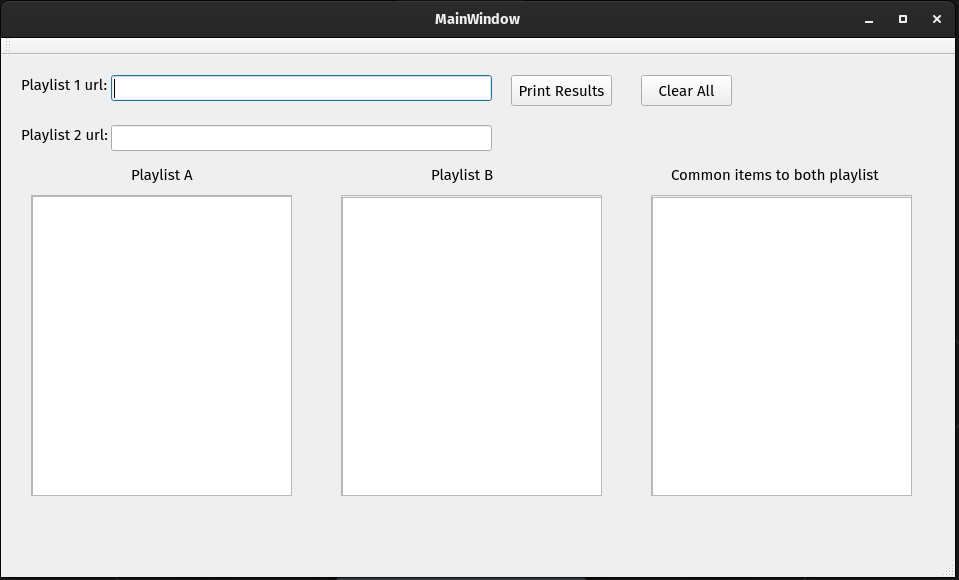

# Playlist_segregator

##### This has a script written in python to find out the commons in two playlists of youtube, remove them and only publish the 1st and second playlists without any commons and then the ones common in both. It usus the youtube data api within to work.  

##### Currently i'm working on the GUI version of this to enable it for use. working on PyQt5 and authorisation end points

